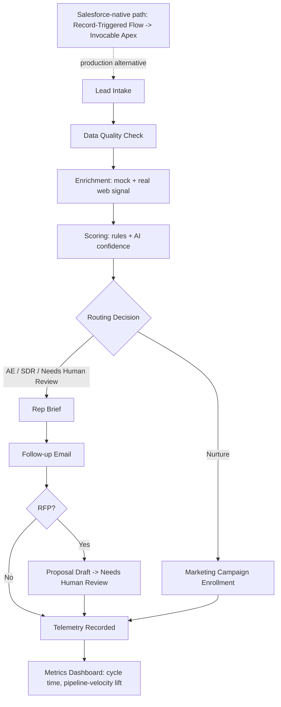

# RevOps AI Copilot

A working portfolio demo built for a Cengage job application (AI Automation Engineer – Sales &
Marketing). It simulates a Salesforce-centered "Revenue Ops AI Copilot" that takes an inbound
lead or RFP request and automates enrichment, scoring/routing, rep-brief and email generation,
proposal drafting, and telemetry — the way this role's JD describes the day-to-day work.

**Status:** implemented and working end-to-end in mock mode (38 unit tests passing; all 8 sample
scenarios run deterministically with no API key and no network). See `CLAUDE.md` for the current
build status and `LEARNING.md` for facts verified during the build.

> Note: the real web-enrichment source (Scrapling) is opt-in via `REVOPS_WEB_ENRICHMENT=1` so the
> default demo path is fully offline and deterministic; it falls back to mock on any failure.

## Why this exists (business value)

Sales and RevOps teams lose hours per lead to manual research, inconsistent scoring, and slow
follow-up. This demo shows how a right-sized AI layer — not a black box, with guardrails and a
human-review gate — can compress that cycle time while staying auditable. It's built specifically
to map to this JD's responsibilities, not as a generic AI chatbot demo.

## JD-responsibility mapping

| JD responsibility | Where it's demonstrated |
|---|---|
| AI-powered lead qualification, scoring, and routing integrated with Salesforce | `services/scoring_service.py`, `services/routing_service.py`, `clients/salesforce_client.py` |
| Automate proposal generation / RFP response workflows using LLMs | `services/content_library_service.py`, `services/generation_service.py`, `services/guardrails_service.py` |
| AI assistants for account research, call prep, and follow-up | Rep Brief + Follow-up Email generation (`services/generation_service.py`) |
| Automate campaign workflows across marketing platforms | `clients/marketing_platform_client.py`, called for every Nurture-routed lead |
| Data quality, hygiene, and enrichment automation | `services/data_quality_service.py`, `clients/enrichment_client.py` (real Scrapling-based web signal + mock fallback) |
| Instrument workflows with telemetry; monitor for reliability/drift | `services/telemetry_service.py` (SQLite metrics) + Opik tracing in `llm/claude_client.py` |
| Quantify cycle-time reduction and pipeline velocity gains | Metrics Dashboard page — automated-vs-manual cycle time, pipeline-velocity lift % and $ |
| Integrate AI directly into Salesforce via Apex, Flow, Einstein | `salesforce_native/` — illustrative Invocable Apex + Flow definition (not executed by the demo) |
| Ship weekly improvements, maintain documentation/runbooks | `CHANGELOG.md`, this README, `CLAUDE.md`/`LEARNING.md` |

## Architecture



Every external dependency (Claude, Opik, Scrapling, Salesforce, marketing platforms) has a
mock/template fallback — nothing hard-crashes the demo if a key or package is missing.

## Setup & Run

```bash
python -m venv .venv && source .venv/bin/activate
pip install -r requirements.txt
streamlit run app.py
```

Runs immediately in **mock/template mode** — no API key required, fully deterministic.

To enable live Claude generation and Opik tracing, copy `.env.example` to `.env` and fill in:

```bash
cp .env.example .env
# then set ANTHROPIC_API_KEY=... (and optionally OPIK_API_KEY=...)
```

Run tests: `python -m unittest discover tests`

## Demo script (3–5 minutes)

1. **Hot Enterprise — State University System**: select it, hit "Run Copilot," narrate each step
   as it renders — data quality, enrichment, scoring breakdown, AE routing, rep brief, email.
2. **RFP — Community College District**: shows the proposal-draft branch and the "Needs Human
   Review" banner (proposals are always gated to human review, by design).
3. **Ambiguous — Workforce Training Co**: shows rule-score vs. AI-confidence disagreeing, forcing
   Needs Human Review — the guardrail/fallback story in action.
4. Flip to **Before vs. After** for a qualitative + quantitative manual-vs-automated comparison.
5. End on **Metrics Dashboard**: cycle time, automation success rate, and the pipeline-velocity
   lift estimate — tie it back to revenue language, not just "seconds saved."

## Limitations (stated plainly)

- Salesforce, marketing-platform (Marketo/HubSpot/SFMC), and ZoomInfo/Clearbit/Apollo-style
  enrichment are mocked interfaces, not live integrations. `WebEnrichmentClient` is the one
  genuinely real integration (a lightweight, etiquette-respecting web fetch).
- Manual-baseline timings and the pipeline-velocity model are illustrative assumptions based on
  the sample data, not measured production data.
- Single-user, local SQLite, no auth — a demo, not a production service.
- `salesforce_native/` Apex/Flow files are illustrative only; they are not deployed to or tested
  against a real Salesforce org.

## Swappable for production

- `clients/salesforce_client.py` -> `simple_salesforce` against a real org (or the
  `salesforce_native/` Apex/Flow path for a fully native deployment).
- `clients/enrichment_client.py` -> a real ZoomInfo/Clearbit/Apollo SDK/API.
- `clients/marketing_platform_client.py` -> real Marketo/HubSpot/Salesforce Marketing Cloud APIs.
- Scoring's rule-engine constants (`SCORING_WEIGHTS`) are named and tunable — a real deployment
  would tune these against historical conversion data instead of illustrative defaults.
